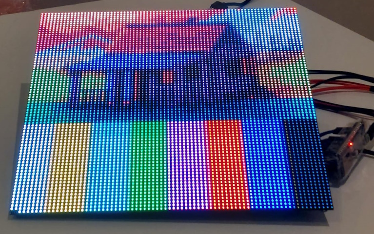
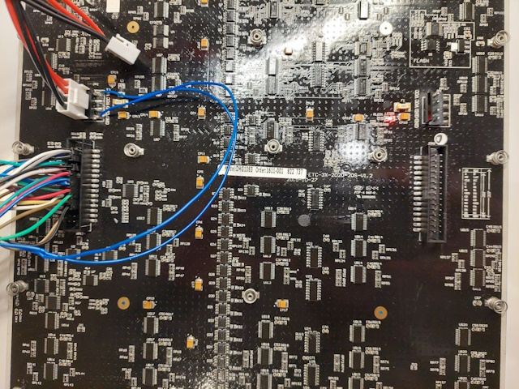

# ESP32S3-MBI5153-DMG1075-LED-MatrixPanel
An experimental Arduino sketch to drive an 'DMG1075' 78x78px RGB LED Matrix Panel (based on the MBI5153).

Based on ESP32S3 only.

### Still to do
* Implement DMA, PWM or RMT based driving based on [advice](https://github.com/mrfaptastic/ESP32-HUB75-MatrixPanel-DMA/discussions/324#discussioncomment-7845435)
* Hook it up to a general graphic library, and local 24bit pp buffer.

### Further Information
Further details on the panel here: https://led.limehouselabs.org/docs/tiles/dmg1083/

