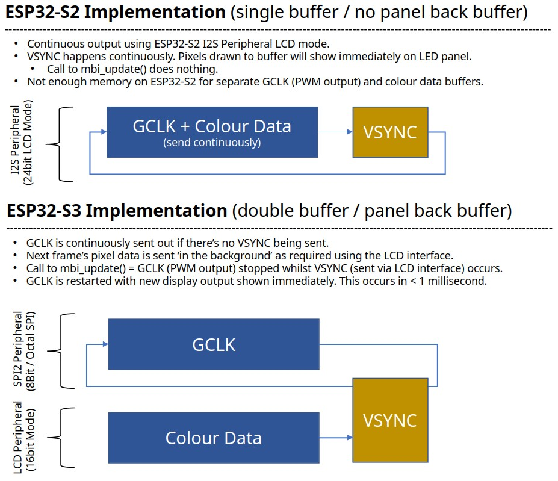

## Using a 78 x 78 pixel MBI5153 based PWM LED MatrixPanel with a ESP32-S2 or S3.

Uses PWM based chip that takes 16 bits sent in a series for every pixel in the relevant chain.

There are 12 channels, as the panel is broken into 4 x RGB sections for each 1/4 of the panel (20 pixel in height each, for a total of 80px of which only 78 physical pixels exist).

The code compensates for the 2 'ghost' pixels.

More info on the panels here: https://led.limehouselabs.org/docs/tiles/dmg1083/

## Software and Hardware implementation(s)
There are two hardware implementations for this LED panel, as one implementation isn't enough for me. As these two Espressif MCU’s have different capabilities and constraints, the software implementations are different. 

tl/dr - The ESP32-S3 is the best device to use of the two implementations. However, the ESP32-S2 is super cheap to buy and does the job depending on your needs. 

